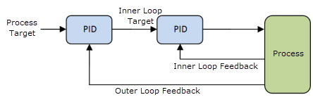

# ESP32_PID
 
This project uses ESP32 DevKit module and ESP-IDF to implement a cascaded PID controller with two nested control loops. A controller like this is usually used for CC-CV (constant current - constant voltage) Li-Ion battery charging, where the inner loop regulates current and the outer loop regulates voltage, or for motor control, where the inner loop regulates current and the outer loop regulates speed. The achieved sampling rate is 6.67kHz and is dictated by the code execution time.

## Code outline
The app_main() just sets up the tasks and peripherals and then loops indefinitely. Every 150us a timer interrupt is generated and the interrupt routine timer_on_alarm() gets executed. Since **ESP32 cannot do floating point operations in an interrupt routine**, its only job is to notify the pid_task() task to start running. In this task firstly the current and voltage measurements are acquired through the ADC oneshot read and then the updated PID output (duty cycle) gets calculated. Finally this new duty cycle is written into the LEDC PWM peripheral.

## Possible improvements
PID implementation could be made better if we had used ADC continuous sampling with interrupt generation. This would get the measurements ready at the start of the interrupt routine and greatly decrease execution time (therefore increasing the achievable sampling rate). Sadly there is a known issue of unsteady ESP32 ADC sampling rates (https://github.com/espressif/esp-idf/issues/10612), which can easily make the controller unstable. 